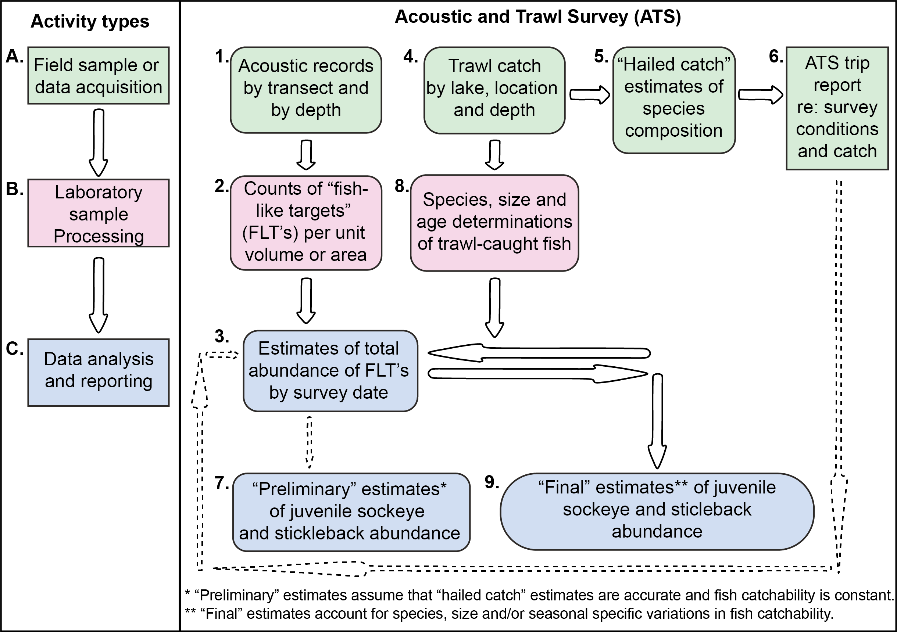

# INTRODUCTION

  The former Fisheries Research Board of Canada (FRB), currently integrated to the Department of Fisheries and Oceans Canada (DFO), discovered through their experimental study conducted from 1969 to 1975 in British Columbia (BC), Canada, that increasing inorganic nutrient supplies in lakes would increase production in their succeeding trophic levels [@hyattLakeEnrichmentProgram1984; @lebrasseurEnhancementSockeyeSalmon1978]. The results of this experiment led to the partnership of the Federal and BC Provincial governments to create the Salmonid Enhancement Program (SEP) in 1977, which funded the development of the Lake Enrichment Program (LEP) [@hyattLakeEnrichmentProgram1984]. The LEP was an expanded version of the trial experiment with the goal of not only enhancing sockeye salmon production in BC lakes using fertilization techniques but also developing the ideal techniques to better enrich and monitor these lakes [@hyattLakeEnrichmentProgram1984]. This program and other related surveys have been conducted by the Salmon in Regional Ecosystems (SiRE) program within Ecosystem Science Division of the DFO since 1977.

  The initiative of fertilizing BC lakes started solely as an enhancement technique to increase production in response to the decline in salmon escapements in Northeast Pacific [@greshEstimationHistoricCurrent2000], particularly in BC. Adult salmons return from the ocean to their natal stream to spawn, and their eggs are incubated during the winter. Juvenile salmons develop from alevin to fry, and they continue to grow in freshwater until they reach the smolt stage, when they migrate to the ocean. However, the survival of salmons and the completion of their complex life cycle were impacted by human-related activities, such as intensive fisheries, habitat degradation, and construction of dams [@baileyOsoyoosLakeSockeye2025; @centerforsystemsintegration2019a; @ogdenWildSalmonPolicy2025a]. According to @shortreedFactorsLimitingJuvenile2001, people's perception towards LEP program gradually changed and the fertilization also became a method to restore the lakes' ecosystems alongside other fisheries management initiative.

  Throughout the program, the high qualified personnel associated with the DFO and the Pacific Salmon Commission (PSC) have collected comprehensive limnological and biological survey data. A series of hydro-acoustics and trawl biosampling were conducted to estimate the abundance of fish, especially Sockeye and Stickleback, in the freshwater bodies of BC [@hyattAcousticTrawlBased2000]. The procedures followed in these field works were developed between the 1970's and early 1980's, and they involved a combination of echo-sounder and trawl sampling techniques [@hyattLakeEnrichmentProgram1984; @hyattAcousticTrawlBased2000; @gjernesPortableMidwaterTrawling1979; @robinsonPopulationEstimatesSockeye1978; @simpsonFishSurveys151981; @gjernesDevelopmentSpecificationsUse1986; @maclellanEvaluationMethodsUsed2010]. In the figure \@ref(fig:schematic-fig), a schematic flowchart presents an overview of the steps taken to acquire, manage and consolidate the Acoustic Trawl Survey (ATS) data. Since the creation of the LEP, also recognized as Sockeye salmon nursery lake fertilization program, several technical reports and scientific publication reported the protocols developed and results obtained from the LEP [@lebrasseurEnhancementSockeyeSalmon1978; @hyattResponsesSockeyeSalmon1985; @robinsonSockeyeSalmonOncorhynchus1975; @hyattSockeyeSalmonOncorhynchus2004; @shortreedFactorsLimitingJuvenile2001; @robinsonPopulationEstimatesSockeye1978].


## Acoustic and Trawl Survey (ATS) data

  The extensive limnological data holdings include, among other information, fish counts using hydro-acoustics and data collected using trawls across waterbodies located in BC. As in the acoustic data, the trawl data include fish species other than Sockeye and Stickleback, but also specimen biological information such as length, weight and life stage. Both acoustic and trawl data were originally processed by lab technicians using proprietary software and saved by ATS year as .DAT data files. Considering that .DAT files are programme-specific, the data were later converted into different data formats to facilitate processing in different software applications. Although some of the data were extracted from the .DAT original files, it was unclear which data were successfully transferred because they were lost during the conversion process.

  Recently, the DFO partnered with the Canadian Institute of Ecology and Evolution (CIEE) Living Data Project (LDP) to rescue, clean, standardize, and make this legacy data publicly available for all. In 2025, two then-graduate students, Alice Assmar and Yuliya Shtymburska, were appointed as interns to work with the DFO-ATS historical data. Therefore, in this report, we present the final standardized hydro-acoustic and trawl biosampling datasets, collected in BC waterbodies over the 29-year interval (1977-2007), and compiled during the DFO-CIEE internship program. The purposes of the present report are to: i) disseminate the standardized data and provide comprehensive documentation of their associated metadata; ii) detail the data rescue methods used to recover the data; and iii) provide an overview of trip effort and the methodological practices used in the ATS field sampling. Detailed information on the hydro-acoustic fish abundance estimates obtained from echo-sounders of "fish-like-target" (FLTs) can be also found in the @zotero-item-913 report. For the data collected using trawl biosampling, the methods to recover them are described in the present paper.

```{r schematic-fig, fig.cap="Flowchart showing the activity types (A-C) and sequential steps (1-9) performed to generate acoustic and trawl survey (ATS) estimates of limnetic fish abundance in the lakes of British Columbia. Modified from Hyatt et al. (2000).", out.width = "100%"}



```