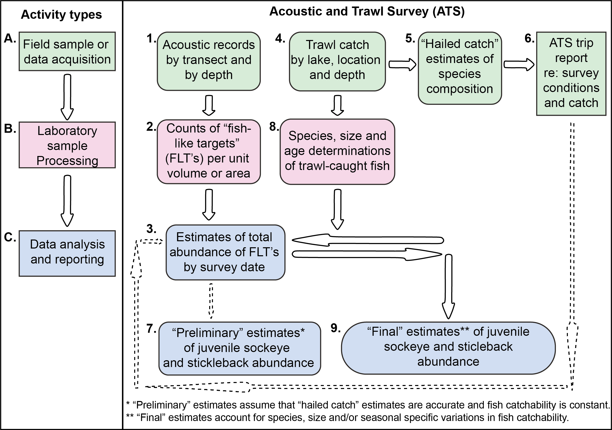
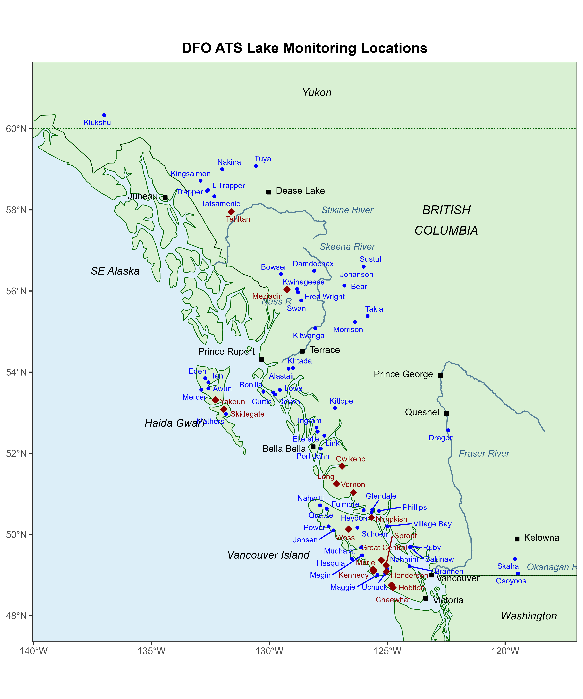
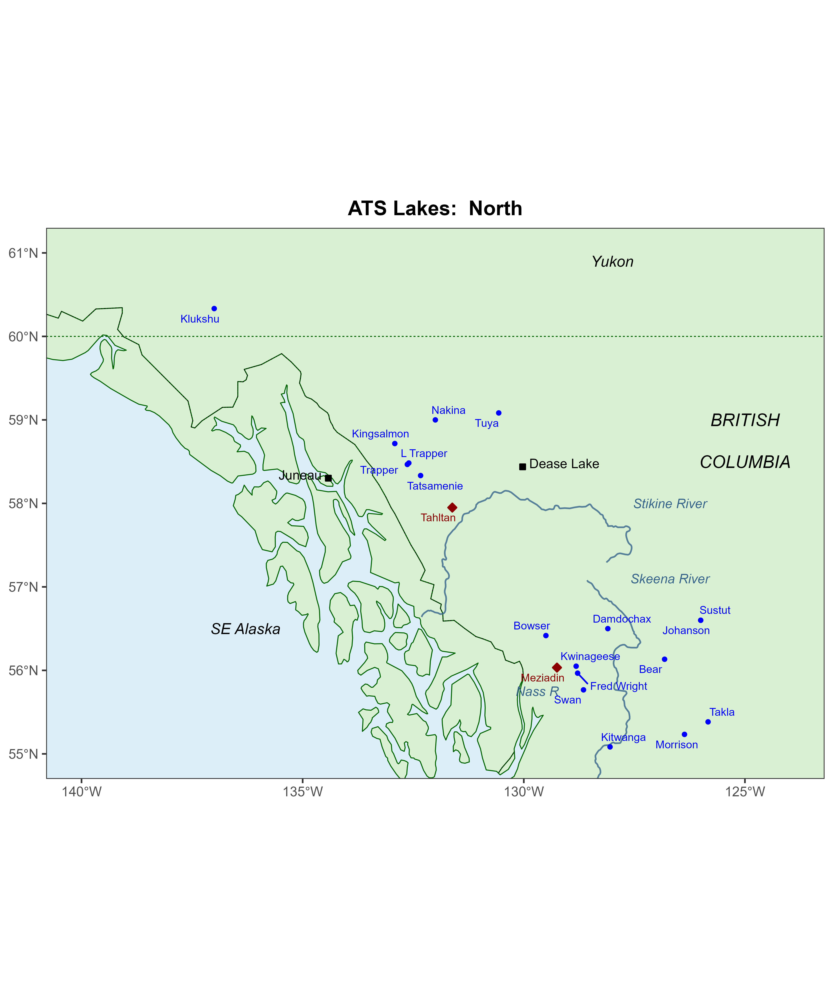
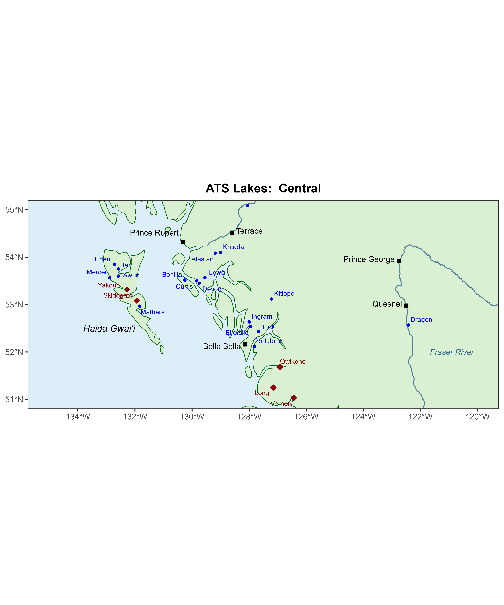
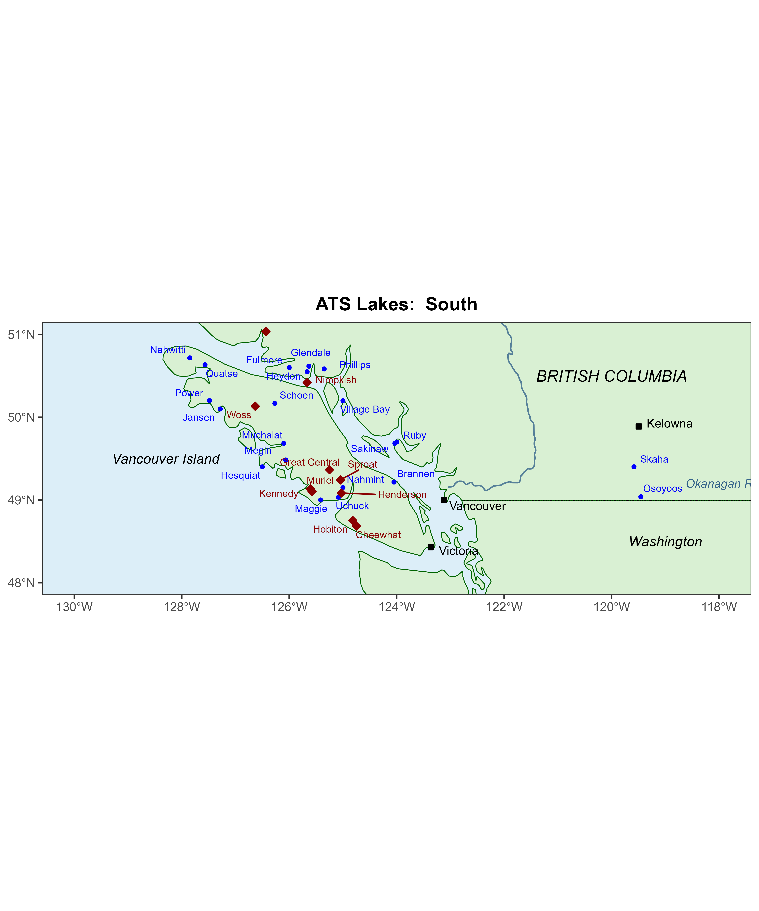
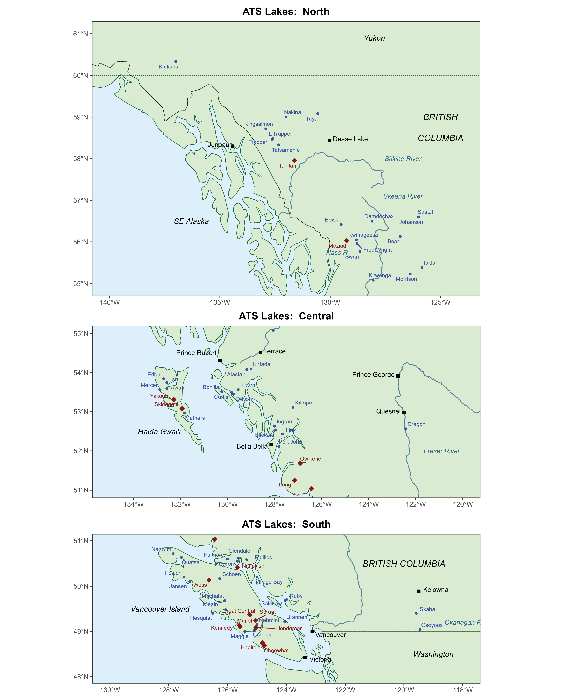

# INTRODUCTION

  The former Fisheries Research Board of Canada (FRB), currently integrated into the Department of Fisheries and Oceans Canada (DFO), discovered through their experimental studies conducted from 1969 to 1975 in British Columbia (BC), Canada, that increasing inorganic nutrient supplies in lakes would increase production in their succeeding trophic levels [@hyattLakeEnrichmentProgram1984; @lebrasseurEnhancementSockeyeSalmon1978]. The results of these experiments led to the partnership of the Federal and BC Provincial governments to create the Salmonid Enhancement Program (SEP) in 1977, which funded the development of the Lake Enrichment Program (LEP) [@hyattLakeEnrichmentProgram1984]. The LEP was an expanded version of the trial experiments with the goal of not only enhancing Sockeye Salmon production in BC lakes using fertilization techniques, but also developing the ideal techniques to better enrich and monitor these lakes [@hyattLakeEnrichmentProgram1984]. This program and other related surveys have since been conducted by the Salmon in Regional Ecosystems (SiRE) program within Ecosystem Science Division of the DFO since 1977.

  The initiative of fertilizing BC lakes started solely as an enhancement technique to increase production in response to the decline in salmon escapements in Northeast Pacific [@greshEstimationHistoricCurrent2000], particularly in BC. Adult salmon return from the ocean to their natal stream to spawn, and their eggs are incubated during the winter. Juvenile salmon develop from alevin to fry, and they continue to grow in freshwater until they reach the smolt stage, when they migrate to the ocean. However, the survival of salmon and the completion of their complex life cycles were impacted by human-related activities, such as intensive fisheries, habitat degradation, and construction of dams [@baileyOsoyoosLakeSockeye2025; @centerforsystemsintegration2019a; @ogdenWildSalmonPolicy2025a]. According to @shortreedFactorsLimitingJuvenile2001, there was a gradual shift in stakeholders’ perspectives regarding the LEP program over time, and the fertilization also became a method to restore or enhance the lakes' ecosystems alongside other fisheries management initiatives.

  Throughout the program, the DFO field crews have collected comprehensive limnological and biological survey data. DFO conducted hydroacoustic surveys and trawl biosampling to estimate fish abundance of fish, especially Sockeye Salmon and Stickleback, in the freshwater bodies of BC [@hyattAcousticTrawlBased2000]. The procedures followed in these field surveys were developed between the 1970's and early 1980's, and they involved a combination of echo-sounding and trawl sampling techniques [@hyattLakeEnrichmentProgram1984; @hyattAcousticTrawlBased2000; @gjernesPortableMidwaterTrawling1979; @robinsonPopulationEstimatesSockeye1978; @simpsonFishSurveys151981; @gjernesDevelopmentSpecificationsUse1986; @maclellanEvaluationMethodsUsed2010]. In Figure \@ref(fig:schematic-fig), a schematic flowchart presents an overview of the steps taken to acquire, manage and consolidate the Acoustic and Trawl Survey (ATS) data. Since the creation of the LEP, also recognized as a Sockeye Salmon nursery lake fertilization program, several technical reports and scientific publication reported the protocols developed and results obtained from the LEP [@lebrasseurEnhancementSockeyeSalmon1978; @hyattResponsesSockeyeSalmon1985; @robinsonSockeyeSalmonOncorhynchus1975; @hyattSockeyeSalmonOncorhynchus2004; @shortreedFactorsLimitingJuvenile2001; @robinsonPopulationEstimatesSockeye1978]. The purpose of this report is to describe, document, and summarize limnetic acoustic survey and trawl biosample datasets collected during DFO LEP program from 1977 to 2007.


```{r schematic-fig, fig.cap="Flowchart showing the activity types (A-C) and sequential steps (1-9) performed to generate acoustic and trawl survey (ATS) estimates of limnetic fish abundance in the lakes of British Columbia. Modified from Hyatt et al. (2000).", out.width = "100%"}



```


## Field Methods Background
### Study Area of the Lake Enrichment Program
ATS work conducted in British Columbia sampled a total of 77 lakes, or 95 sites, including lake subdivisions, from 1977-2007. The lakes surveyed in the program were located mainly in the coastal areas of British Columbia (Figs. \@ref(fig:map-fig) - \@ref(fig:map-fig2)). According to @hyattResponsesSockeyeSalmon1985, the lakes shared the following characteristics: considerably low phosphorus concentrations, rapid replacement of water due to high flows, and extreme oligotrophic conditions. 

### Field Procedures
This section summarizes field procedures used from 1977-2007, but background details on methods used for acoustic limnetic fish estimations and tow net trawl biosamples are explained in detail in the following reports: @hyattLakeEnrichmentProgram1984; @hyattAcousticTrawlBased2000; @gjernesPortableMidwaterTrawling1979; @gjernesDevelopmentSpecificationsUse1986; @hyattResponsesSockeyeSalmon1985. For the LEP, at least one transect was delimited per basin and four transects per lake [@RankinRutherford1985]. Ideal techniques to assess fish population in lakes vary depending on the characteristics of the lake, such as size, depth, elevation; @maclellanEvaluationMethodsUsed2010 presented more up-to-date methods adopted by DFO to conduct fieldwork.


```{r map-fig, fig.cap="Lakes surveyed during the Lake Enrichment Program (LEP) in British Columbia. The 16 most surveyed lakes are represented as red diamonds.", out.width = "100%"}



```


```{r map-fig2, fig.cap="Regional distribution of LEP-surveyed lakes in northern, central, and southern British Columbia.", out.width = "100%"}

#
#
#



```

### *Acoustic Target*
The single-beam sounder used from the early 1970s to the early 1980s was the Furuno (FM 22 and FNV-3000) [@robinsonPopulationEstimatesSockeye1978], and in 1984 onward the SIMRAD was used [@gjernesDevelopmentSpecificationsUse1986]. Technical characteristics of echosounders limit their use in shallow waters, especially within the first metre of depth [@maclellanEvaluationMethodsUsed2010]. Each lake was surveyed using a series of echo-sounding transects, arranged such that the total linear distance surveyed was approximately proportional to lake area [@hyattResponsesSockeyeSalmon1985; @gjernesDevelopmentSpecificationsUse1986]. Acoustic surveys occurred at night as Sockeye Salmon migrate to the surface during this time. Fish abundance was estimated using echo trace counting, with the number of echo traces divided by the sampled volume to estimate fish concentration [@gjernesDevelopmentSpecificationsUse1986].

### *Trawl Biosample*
Trawl netting was used to collect fish specimens for species identification and life history assessments [@robinsonSockeyeSalmonOncorhynchus1975]. This technique complemented hydroacoustic surveys by sampling the water column where hydroacoustic targets were prominent, and surface waters that were beyond the detection range of echosounders. More importantly, this sampling method enabled researchers to identify the species present in the lake from the trawl catches, and the field crew also used it to calibrate the echosounder. Trawls were conducted using a boat-towed net, typically measuring 2 × 2 × 7.5 m. Although it did not occur in our rescued trawl records, variations of the net size were reported in other studies [*e.g.*, @robinsonSockeyeSalmonOncorhynchus1975]. Most fishes were preserved in formalin, with only a small percentage of samples preserved in ethanol. Due to the effects of preservatives on the specimen's length and weight [@Shields1996EffectsOF], these measurements were taken between several weeks and months after collection. Standardized weight was calculated using provided formulas to account for differences in measurement timing and preservative. Some fish were measured fresh and therefore required no conversion. 

### Acoustic and Trawl Survey (ATS) data

  The extensive limnological data holdings include, among other information, fish counts using hydroacoustics and data collected using trawls across waterbodies located in BC. As in the acoustic data, the trawl data include fish species other than Sockeye Salmon and Stickleback, but also biological information such as length, weight and life stage. Both acoustic and trawl data were originally processed by lab technicians using proprietary software and saved by ATS year as .DAT data files. Considering that .DAT files are programme-specific, the data were later converted into different data formats to facilitate processing in different software applications. Although some of the data were extracted from the .DAT original files, it was unclear which data were successfully transferred because they were lost during the original conversion process.

## Purpose

  Recently, the DFO partnered with the Canadian Institute of Ecology and Evolution (CIEE) Living Data Project (LDP) to rescue, clean, standardize, and make this legacy data publicly available. In 2025, two then-graduate students, Alice Assmar and Yuliya Shtymburska, were appointed as interns to work with the DFO-ATS historical data. Therefore, in this report, we present the final standardized hydroacoustic and trawl biosampling datasets, collected in BC waterbodies over the 29-year interval (1977-2007), and compiled during the DFO-CIEE internship program. The purposes of the present report are to: i) disseminate the standardized data and provide comprehensive documentation of their associated metadata; ii) detail the data rescue methods used to recover the data; iii) facilitate future ecological and fisheries research; and iv) provide an overview of trip effort and the methodological practices used in the ATS field sampling. Detailed information on the hydroacoustic fish abundance estimates obtained from echo-sounders of "fish-like-target" (FLTs) can be also found in the @zotero-item-913 report. For the data collected using trawl biosampling, the methods to recover them are described in the present paper.
