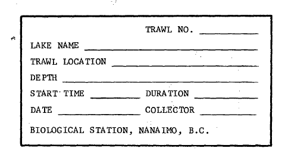

# RESULTS

K factors are available in the dataset, the methods should outline how they were used to fix some anomalous lengths and/or weights.
two pinks were found.

```{r figure-scale-book, fig.cap="Example of a scale book record form.", out.width="60%"}

include_graphics("../TRAWL_BIOSAMPLE/06_Figures/scale_book1.jpg")

```


```{r figure-sample, fig.cap="Example of scale samples on a scale book.", out.width="60%"}

include_graphics("../TRAWL_BIOSAMPLE/06_Figures/scale_book2.jpg")

```

```{r sample-label, fig.cap="Example of Trawl sample label.", out.width="60%"}



```

```{r bubble_heatmap, fig.cap = "Heatmap showing the survey effort per lake per year. Bubble colours specify the source dataset (Acoustic or Trawl), and the size of the bubble is proportional to the number of events.", fig.width=6, out.width="100%", fig.asp = 11.69/8.27}

############## Read csv tables
Acoustic_data <- read.csv("./00_data/Target_OUTPUT_data_FINAL_(1977_2007).csv")
Trawl_data <- read.csv("./00_data/Trawl_data_FINAL_1977-1999.csv")
lake_name <- read.csv("./00_data/lake_codes.csv")

### Global variables
lakes_of_interest <- c("Great Central Lake", "Sproat Lake (Two R)", "Sproat Lake", "Henderson Lake", "Kennedy Lake (Clay)", "Kennedy Lake (Main)", "Cheewhat Lake", "Muriel Lake", "Hobiton Lake", "Long Lake", "Long Lake (A)", "Long Lake (B)", "Owikeno Lake", "Tahltan Lake", "Meziadin Lake")

### Count survey effort for both acoustic and trawl data
### Trawl
unique_surveys_trawl <- Trawl_data %>%
  distinct(lake_name, trawl_date, ats_year)

survey_counts_trawl <- unique_surveys_trawl %>%
  group_by(lake_name, ats_year) %>%
  summarise(n_surveys = n(), .groups = "drop") %>%
  mutate(dataset = "Trawl")

### Acoustic
# Remove abbreviations in the name of the lakes in the Acoustic dataset by importing the lookup table
lake_name <- read.csv("./00_data/lake_codes.csv")

# re-assign lake codes
Acoustic_data <- Acoustic_data %>%
  mutate(lake_code = case_when(lake_code == 248 ~ 180,
                               lake_code == 250	~ 50,
                               lake_code == 247	~ 121,
                               lake_code == 251	~ 237,
                               lake_code == 249	~ 59,
                               lake_code == 252	~ 122,
                               lake_code == 255	~ 241,
                               TRUE ~ lake_code))

# Join the tables
Acoustic_data <- Acoustic_data %>%
  mutate(lake_code = case_when(lake_code == 124 ~ 180,
                               TRUE ~ lake_code)) %>%
  left_join(lake_name, by = "lake_code")

# Find unique records
unique_surveys_acoustic <- Acoustic_data %>%
  distinct(lake_name, survey_date, ats_year)

survey_counts_acoustic <- unique_surveys_acoustic %>%
  group_by(lake_name, ats_year) %>%
  summarise(n_surveys = n(), .groups = "drop") %>%
  mutate(dataset = "Acoustic")

### combine trawl and acoustic
survey_effort_combined <- bind_rows(survey_counts_acoustic, survey_counts_trawl)

# bubble heatmap
ggplot(data = survey_effort_combined, aes(x = ats_year, y = lake_name, 
                                                          size = n_surveys, colour = dataset)) +
  geom_point(alpha = 0.5, position = position_dodge(width = 0.2)) +
  scale_x_continuous(breaks = 1977:2007, expand = c(0.01, 0.01)) +
  scale_size(range = c(1,8), name = "Survey effort") +
  labs(x = "ATS year", y = "Lake", color = "Dataset") +
  ggtitle("Survey effort per lake per year") +
  scale_colour_viridis_d(option = "viridis") +
  theme_bw() +
  theme(plot.title = element_text(hjust = 0.5),
        axis.text.x = element_text(angle = 90, vjust = 0.5, size = 10),
        axis.text.y = element_text(size = 9),
        panel.grid.major = element_line(colour = "grey90"),
        panel.grid.minor = element_blank())

```

```{r duration_distribution, fig.cap="Histogram showing the distribution of original and calculated duration values (calculated using orig_start_time and orig_end_time) in minutes across unique trawl events. Duplicate records sharing the same trawl_unique_ID and calc_duration_time were removed prior to plotting so that each trawl event was represented once."}

unique_calc_duration <- Trawl_data %>%
  distinct(calc_duration_time, trawl_unique_ID, orig_duration_minutes)

unique_calc_duration <- unique_calc_duration %>%
  pivot_longer(cols = c(calc_duration_time, orig_duration_minutes),
               names_to = "type", values_to = "duration") %>%
  filter(!is.na(duration))

ggplot(unique_calc_duration, aes(x = duration, fill = type)) +
  geom_histogram(binwidth = 5, position = "dodge", color = "white", linewidth = 0.3) +
  scale_fill_viridis_d(name = "Duration type",
                      labels = c("Calculated duration", "Original duration"),
                      option = "D") +
  labs(x = "Duration (min)", y = "Frequency") +
  theme_bw()
```

```{r depth, fig.cap="Histogram of the distribution of depth (m) frequency across all lakes for acoustic sounding. See the Results section for additional information about the zero bin."}
unique_depth <- Trawl_data %>%
  distinct(depth_m, trawl_unique_ID, lake_name)

ggplot(data = unique_depth, aes(depth_m)) +
  geom_histogram(binwidth = 2, position = "dodge", color = "white", linewidth = 0.3, fill = "#440154") +
  labs(x = "Depth (m)", y = "Frequency") +
  theme_bw()
```

```{r depth-by-lake, fig.cap="Histogram of the distribution of depth (m) data in some lakes of interest.", fig.width=6, out.width="100%", fig.asp = 11.69/8.27}
# Filter only the lakes of interest (loi)
unique_depth_filtered <- unique_depth %>%
  filter(lake_name %in% lakes_of_interest)

ggplot(data = unique_depth_filtered) +
  geom_histogram(aes(x = depth_m), binwidth = 1) +
  labs(x = "Depth (m)", y = "Frequency") +
  facet_wrap(~ lake_name, ncol = 3, scale="free") +
  theme_bw()
```

```{r all-spp-scatter-plot, fig.cap="Scatter plot illustrating the relationship between fish length and weight for all species included in the trawl dataset."}
# Drop any adult codes.
scatter_plot_all_spp <- Trawl_data %>%
  filter(!life_stage %in% c("Gravid female", "Adult", "Adult female")) %>%
  arrange(match(species_common_name, c("Stickleback", "Sockeye", "Sculpin", "Lamprey", "Peamouth Chub", "Coho", "Whitefish", "Chinnook", "Dolly Varden", "Pink", "Red-sided Shiner", "Sucker", "Kokanee")))

# Color Pallete 
#viridisLite::plasma(13)

# Scatter plot
ggplot(data = subset(scatter_plot_all_spp, !is.na(species_common_name)), 
       aes(x = fish_length_mm, y = fish_weight_g, shape = species_common_name, colour = species_common_name)) + 
  geom_point(alpha = 0.5, position = position_jitter()) +
  scale_shape_manual(values = c("Sculpin" = 16,
                                "Lamprey" = 17,
                                "Peamouth Chub" = 15,
                                "Coho" = 18,
                                "Stickleback" = 7,
                                "Whitefish" = 1,
                                "Chinnook" = 2,
                                "Dolly Varden" = 5,
                                "Pink" = 3,
                                "Red-sided Shiner" = 4,
                                "Sockeye" = 0,
                                "Sucker" = 8,
                                "Kokanee" = 9), name = "Species") +
  #scale_color_viridis_d(option = "C", begin = 0, end = 1, name = "Species") +
  scale_color_manual(values = c("Sculpin"= "#0D0887FF", 
                                "Lamprey"="#3B049AFF", 
                                "Peamouth Chub"="#5D01A6FF", 
                                "Coho"="#7E03A8FF", 
                                "Stickleback"="#9C179EFF", 
                                "Whitefish"="#B52F8CFF", 
                                "Chinnook"="#CC4678FF", 
                                "Dolly Varden"="#DE5F65FF", 
                                "Pink"= "#ED7953FF", 
                                "Red-sided Shiner"="#F89441FF",
                                "Sockeye"="#FDB32FFF",
                                "Sucker"="#FBD424FF" ,
                                "Kokanee"="#F0F921FF"), name = "Species")+
  #scale_fill_gradientn(colors = heat.colors(1), name = "Species") +
  labs(x="Fish length (mm)", y = "Fish weigth (g)") +
  #ggtitle("Fish length and weigth") +
  #theme(plot.title = element_text(hjust = 0.5)) +
  theme_bw()

```

```{r hist-length-weight-by-lake, fig.cap="Histograms of the distribution of Sockeye and Stickleback length and weight across surveyed lakes."}

df_plot <- Trawl_data %>%
  filter(lake_name %in% lakes_of_interest,
    species_common_name %in% c("Sockeye", "Stickleback")) %>%
  rename("Length (mm)" = fish_length_mm, "Weight (g)" = fish_weight_g) %>%
  select(lake_name, species_common_name, `Length (mm)`, `Weight (g)`) %>%
  pivot_longer(cols = c(`Length (mm)`, `Weight (g)`), names_to = "measurement", values_to = "value") %>%
  arrange(lake_name)

lakes <- unique(df_plot$lake_name)

for (lk in lakes) {

  df_lk <- filter(df_plot, lake_name == lk)

  p <- ggplot(df_lk, aes(x = value)) +
    geom_histogram(bins = 40, fill = "steelblue", color = "black") +
    facet_grid(rows = vars(species_common_name), cols = vars(measurement), scales = "free") +
    labs(title = paste(lk),
         x = NULL,
         y = "Count") +
    theme_bw()
  
  print(p)
}

#plots <- list()
#
#for (lk in lakes) {
#
#  df_lk <- filter(df_plot, lake_name == lk)
#
#  plots[[lk]] <- ggplot(df_lk, aes(x = value)) +
#    geom_histogram(bins = 40, fill = "steelblue", color = "black") +
#    facet_grid(rows = vars(species_common_name), cols = vars(measurement), scales = "free") +
#    labs(title = paste(lk),
#         x = NULL,
#         y = "Count") +
#    theme_bw()
#}
#
#plots[["Cheewhat Lake"]]
```
```{r GCL-plot, fig.cap="Histograms of the distribution of Sockeye and Stickleback length and weight in Great Central Lake."}
#plots[["Great Central Lake"]]
#plots[["Henderson Lake"]]
#plots[["Hobiton Lake"  ]]
#plots[["Kennedy Lake (Clay)" ]]
#plots[["Kennedy Lake (Main)"]]
#plots[["Long Lake"    ]]
#plots[["Long Lake (A)"]]
#plots[["Long Lake (B)"]]
#plots[["Meziadin Lake"]]
#plots[["Muriel Lake"  ]]
#plots[["Owikeno Lake"]]
#plots[["Sproat Lake"]]
#plots[["Sproat Lake (Two R)" ]]
#plots[["Tahltan Lake" ]]
```


```{r hist-length-weight-by-year, fig.cap="Histograms of the distribution of Sockeye and Stickleback length and weight by sampled ATS year."}
df_plot_year <- Trawl_data %>%
  filter(lake_name %in% lakes_of_interest,
    species_common_name %in% c("Sockeye", "Stickleback")) %>%
  rename("Length (mm)" = fish_length_mm, "Weight (g)" = fish_weight_g) %>%
  select(ats_year, lake_name, species_common_name, `Length (mm)`, `Weight (g)`) %>%
  pivot_longer(cols = c(`Length (mm)`, `Weight (g)`), names_to = "measurement", values_to = "value") %>%
  arrange(ats_year)

year <- unique(df_plot_year$ats_year)

for (yr in year) {

  df_yr <- filter(df_plot_year, ats_year == yr)

  p <- ggplot(df_yr, aes(x = value)) +
    geom_histogram(bins = 40, fill = "steelblue", color = "black") +
    facet_grid(rows = vars(species_common_name), cols = vars(measurement), scales = "free") +
    labs(title = paste(yr),
         x = NULL,
         y = "Count") +
    theme_bw()

  print(p)
}
```

```{r boxplot-lakes-years, fig.cap="Boxplot showing the distribution of the length and weight of Sockeye and Stickleback species in different lakes across the surveyed years."}

for (lk in lakes) {

  df_lk <- filter(df_plot_year, lake_name == lk)

  p <- ggplot(df_lk, aes(x = factor(ats_year), y = value)) +
    geom_boxplot() +
    facet_grid(rows = vars(measurement),
               cols = vars(species_common_name),
               scales = "free") +
    labs(title = lk, x = "Year", y = NULL) +
    theme_bw() +
    theme(axis.text.x = element_text(angle = 45, hjust = 1))

  print(p)
}
```


```{r separated-spp, fig.cap="Scatter plot illustrating the relationship between fish length and weight for Chinook, Coho, Sockeye and Stickleback specimens included in the dataset. Additionally, a regression curve is also provided, including the annotated coeficients for each species", out.width="100%"}
# Drop any adult codes.
scatter_plot_all_spp_filtered <- Trawl_data %>%
  filter(!life_stage %in% c("Gravid female", "Adult", "Adult female")) %>%
  filter(species_common_name %in% c("Coho", "Chinook", "Stickleback", "Sockeye"))

# Clean data
scatter_plot_all_spp_filtered <- scatter_plot_all_spp_filtered %>%
  filter(!is.na(fish_length_mm), !is.na(fish_weight_g), fish_length_mm > 0, fish_weight_g > 0)

#scatter_plot_all_spp_filtered %>%
#  filter(!is.na(species_common_name)) %>%
#  group_by(species_common_name) %>%
#  summarise(n = n(), unique_lengths = n_distinct(fish_length_mm)) %>%
#  arrange(unique_lengths)

# Fit one model per species
models <- scatter_plot_all_spp_filtered %>%
  group_by(species_common_name) %>%
  nest() %>%
  mutate(model = map(data, ~lm(log(fish_weight_g) ~ log(fish_length_mm), data = .x)) )

# Compute statistical variables: a, b, N and R²
stats <- models %>%
  mutate( intercept = map_dbl(model, ~coef(.x)[1]),
          b = map_dbl(model, ~coef(.x)[2]),
          a = exp(intercept),
          R2 = map_dbl(model, ~summary(.x)$r.squared),
          N = map_int(data, nrow)) %>%
  select(species_common_name, a, b, N, R2)

# Create fitted curves
predictions <- models %>%
  mutate(newdata = map(data, ~data.frame(
      fish_length_mm = seq(min(.x$fish_length_mm),
                           max(.x$fish_length_mm),
                           length.out = 200))),
    prediction = map2( model, newdata,~mutate(.y,
        fish_weight_g = exp(predict(.x, newdata = .y))))) %>%
  select(species_common_name, prediction) %>%
  unnest(prediction)

#Create annotation labels
labels <- stats %>%
  mutate(label = paste0("a = ", signif(a, 3),"\n",
                        "b = ", round(b, 3), "\n",
                        "N = ", format(N, big.mark = ","), "\n",
                        "R² = ", round(R2, 3)))

# Plot the scatter plot
ggplot(scatter_plot_all_spp_filtered, aes(fish_length_mm, fish_weight_g)) +
  geom_point(aes(color = species_common_name), alpha = 0.3) +
  geom_line(data = predictions, aes(y = fish_weight_g), colour = "darkgrey", linewidth = 0.5) +
  geom_text(data = labels, aes(x = -Inf, y = Inf, label = label),
    hjust = -0.05, vjust = 1.1, inherit.aes = FALSE, size = 3) +
  labs(x="Fish length (mm)", y = "Fish weigth (g)", colour = "Species") +
  facet_wrap(~species_common_name, scales = "free") +
  theme_bw()

```

```{r sockeye, fig.cap="Distribution of Sockeye length (mm) and weight (g) data across sampled lakes.", out.width="100%", fig.height=11.69, fig.asp = 11.69/8.27}

Trawl_data_sockeye <- Trawl_data %>%
  filter(!life_stage %in% c("Gravid female", "Adult", "Adult female")) %>%
  filter(lake_name %in% lakes_of_interest) %>%
  filter(species_common_name == "Sockeye") %>%
  arrange(lake_name, match(life_stage, c( "Fry", "1+")))

#ggplot() +
#  geom_point(data = subset(Trawl_data_sockeye, life_stage == "Fry"), 
#       aes(x = fish_length_mm, y = fish_weight_g), color = "#440154", alpha = 0.3) +
#  geom_point(data = subset(Trawl_data_sockeye, life_stage == "1+"), 
#       aes(x = fish_length_mm, y = fish_weight_g), color = "yellow", alpha = 0.5) +
#  labs(x = "Sockeye Length (mm)", y = "Sockeye Weight (g)") +
#  facet_wrap(~lake_name, ncol = 3, scale="free") +
#  theme_bw()

ggplot(Trawl_data_sockeye, aes(x = fish_length_mm, y = fish_weight_g, colour = life_stage)) +
  geom_point(data = subset(Trawl_data_sockeye, life_stage %in% c("1+", "Fry")), alpha = 0.5) +
  scale_color_manual(name = "Life stage",
                     values = c("Fry" = "#440154", "1+" = "yellow")) +
  labs( x = "Sockeye Length (mm)", y = "Sockeye Weight (g)") +
  facet_wrap(~lake_name, ncol = 3, scale = "free") +
  theme_bw()
```

```{r Stickleback, fig.cap="Distribution of Stickleback length (mm) and weight (g) data across sampled lakes.", out.width="100%", fig.height=11.69, fig.asp = 11.69/8.27}

Trawl_data_filtered_life_stage <- Trawl_data %>%
  mutate(life_stage2 = ifelse(life_stage != "Adult" & life_stage != "Adult female"
                              & life_stage != "Fry" & life_stage != "Gravid female"
                              & life_stage != "Subadult", "Unknown", life_stage)) %>%
  filter(species_common_name == "Stickleback") %>%
    filter(lake_name %in% lakes_of_interest) %>%
  arrange(lake_name, match(life_stage2, c("Unknown", "Subadult", "Fry", "Adult", "Gravid female", "Adult female")))

ggplot(data = Trawl_data_filtered_life_stage, 
       aes(x = fish_length_mm, y = fish_weight_g, colour = life_stage2)) +
  geom_point(alpha = 0.5) +
  scale_color_viridis_d(option = "C")+
  labs(x = "Stickleback Length (mm)", y = "Stickleback Weight (g)", color = "Life stage") +
  facet_wrap(~lake_name, ncol = 3, scale="free") +
  theme_bw()

```
