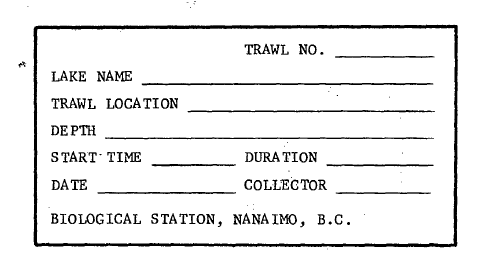

```{r setup, include=FALSE}
knitr::opts_chunk$set(echo = FALSE, warning = FALSE, message = FALSE)
```

**Agency Supervisors** Athena Ogden ([athena.ogden\@dfo-mpo.gc.ca](mailto:athena.ogden@dfo-mpo.gc.ca){.email}) Howard Stiff ([Howard.Stiff\@dfo-mpo.gc.ca](mailto:Howard.Stiff@dfo-mpo.gc.ca){.email}) Patrick Thompson ([Patrick.Thompson\@dfo-mpo.gc.ca](mailto:Patrick.Thompson@dfo-mpo.gc.ca){.email})

**CIEE LDP supervisor** David Hunt (LDP Post-Doc, McGill University)

```{=html}
<style>
  body {
    text-align: justify;
  }
</style>
```

### Data collection

Trawl biosample data collected using trawling method in water bodies located in British Columbia, Canada, from 1977 to 1999 by researchers from Fisheries and Oceans Canada as part of the Lake Enrichment Program (LEP).
Synthetic columns were created during data rescue and validation.
Raw columns were recovered from the original files.

Note that both \*.dat files and SAS files were used as input for this data recovery and data cleaning effort by Alice Assmar.
From 1977 to 1983, only SAS files were extant.
These SAS files were originally derived from the \*.dat files, which have since been lost for those years.
After 1983, and until 1999, both files were available (except for a few corrupted SAS files), and where there were conflicts between the two, the \*.dat values were used.
After 1999, the trawl biosampling data were sometimes available in Excel files held by the Salmon in Regional Ecosystems Program at Fisheries and Oceans Canada (contact Patrick.Thomspon\@dfo-mpo.gc.ca), but the Excel files have not been extracted as part of the current data recovery and cleaning process.

### Description of variables

::: {style="padding-left: 30px;"}
**ats_year:** Trawl biosample year in which the data were collected.
The ats_year runs from April 1 to March 31 of the following calendar year.
Thus, ats_year is equal to calendar year for dates from April 1 to Dec 31, and equal to calender year minus one for dates from Jan 1 to March 31.
This is the year that should be used to group data for annual analysis as it corresponds to the spawning season for the fish.
Grouping by calendar year would result in fish being misassigned to cohorts.
Synthetic column.

**lake_code:** Numeric code identifying the sampled lake in the source file as used in the original dataset.
Used to join lake name and geographic coordinate information via a lookup table (*LDP_ATS_Rescue/TRAWL_BIOSAMPLE/00_raw_data/04_YS_look_up_tables/lake_codes.csv*).
Lake name should be used for modern analysis.
Raw column.

**lake_name:** Name of the lake where the sample was collected.
Synthetic column created using the lake_code and a lookup table (*LDP_ATS_Rescue/TRAWL_BIOSAMPLE/00_raw_data/04_YS_look_up_tables/lake_codes.csv*).
Note that lake No-Name (lake_code 124) was replaced with Link Lake (lake code 180).

**trawl_date:** Trawl sampling date converted to ISO format (YYYY-MM-DD) from a variety of original formats in the original dataset.
Raw column.

**trawl_month:** Month when the trawl biosample data was collected.
Synthetic column extracted frp, trawl_date for use in grouping and organizing data.

**trawl_number:** Trawl record number.
This is a sequential number within a set of trawls conducted together that identifies an individual trawl within that sampling effort.
The record ranges from 1-39, i.e. the maximum number of trawls that were conducted "together" was 39.
Raw column.

**sample_type:** Dimensions of the net used in the sampling event.
It can also provide gear type information.
This data is largely unstandardized and should be standardized before use.
Raw column.

**gear_type:** Specifies gear type when the fishing method used was beach seining.
This information was recovered from the trawl_comment column.
"Trawl" was entered to all other records.
This data has not been fully standardized.
Synthetic column.

**depth_m:** Depth of the trawl sampling in metres.
This variable represents the depth of the trawl event.
The value range is 0–70 metres, with most observations between 0-20 metres.
Two records showed values "188" and "200," which were likely typos.
They were replaced by "18" and "20," respectively, and these changes were flagged in the "depth_m_comments" section of the "general_comments" column.
The distribution of depth data by lake can be found in the *Tables and plots* section.
Raw column.

**orig_start_time:** Standardized start time of the trawl sampling rescued from .sas and .dat files.
The format is "HH:MM:SS".
All values are local time in Pacific Time (UTC−08 or UTC-07 depending on year and time of year).
Records with invalid formats were corrected when possible, or replaced by NAs.
Row issues are flagged in the "data_issues" column.
Raw column.

**orig_end_time:** Standardized end time of the trawl sampling rescued from .sas and .dat files.
The format is "HH:MM:SS".
All values are local time in Pacific Time (UTC−08 or UTC-07 depending on year and time of year).
Records with invalid formats were corrected, when possible, or replaced by NAs.
Row issues are flagged in the "data_issues" column.
Raw column.

**calc_end_time:** Standardized calculated end time of the trawl sampling.
This column contains end times calculated from the provided start time and trawl duration (minutes).
The format is "HH:MM:SS".
All values are local time in Pacific Time (UTC−08 or UTC-07 depending on year and time of year).
In total, 81,916 calculated end times were used when no orig_end_time was in the dataset.
These modifications were flagged in the “data_issues” column.
Synthetic column.

**orig_duration_minutes:** Duration of the trawl sampling in minutes.
This variable represents the duration of each trawl event.
The expected value range is 0–60 minutes, with most observations near 15 minutes.
Values exceeding 60 minutes were flagged in the invalid_duration_time section of the general_comments column as “Greater than 60 min, likely error”.
Extreme values (e.g. 365 and 535) were set to NA.
Raw column.

**calc_duration_time:** Standardized calculated duration time of the trawl sampling.
This column contains duration times calculated from the start time and end time in the original dataset.
Times are reported in minutes.
In total, 3,555 entries do not match original duration (orig_duration_minutes), likely error in orig_end_time column, and 0 missing duration-time values were replaced with calculated duration times.
Mismatches are flagged in the XX section of the XX column.
Synthetic column.

**fish_id:** Integer identifying an individual fish within a sample record, based on its order of appearance.
Note that Sockeye and each age class of Stickleback will sometimes have the same fish_id number on a given date, but never the same fish_unique_ID.
The numbering restarts for each record and ranges from 1 to *fish_total*.
Raw column.

**species_code:** Standardized code identifying the fish species.
This is a synthetic column that was added to the look-up table, *AA_fish_scientific_name_lookup.csv*, and which is used to collapse the different life stages x species into the same species for analysis.
E.g., “Sockeye (juv)” and “Sockeye (fry)” were originally given different species_info_codes, but in the synthetic species_code column in the look-up table, they have the same species_code because both are Sockeye.

**species_common_name:** Widely recognized, non-scientific name to identify the fish species.
Based on the *AA_fish_scientific_name_lookup.csv* table.
Synthetic column.

**life_stage:** Life-cycle stage of the fish at the time of collection.
Synthetically derived from the species_info_code (formerly the LEP “species code”) column.
Uses look-up table: *AA_fish_scientific_name_lookup.csv*.
Synthetic column.

**species_info_code:** Original LEP species code identifying the species name, life stage and, for two codes, age class of the collected fish.
This combination of categorical variables has been resolved into four new separate fields (species_code, species_common_name, life_stage, and age_class), each described above, and tabulated in the *AA_fish_scientific_name_lookup.csv* table, located at *00_raw_data/03_AA_look_up_tables*.
Raw column.

**fish_length_mm:** The total length of the fish from the tip of the snout to the fork/end of the tail in millimeters (i.e., fork length).
Raw column.

**fish_weight_g:** The total weight of the fish in grams, including preservative content.
Raw column.

**orig_std_weight_g:** Standardized fish weight in grams (as reported in the source files), calculated using the provided weight conversion formula based on the preservative in which the specimen was stored.
Weight conversion formulas can be found in the look up tables in the folder *00_raw_data/03_AA_look_up_tables/AA_DFO_preservative_code_lookup_table*.
Raw column.

**calc_std_weight_g:** This value is a re-estimate of the imported “orig_std_weight_g” value, calculated using the observed weight and the weight conversion formula based on the preservative in which the specimen was stored, according to the preservative_code.
Weights are reported in grams.
26 values differ from the original given standardized weight (orig_std_weight_g), indicating potential inconsistencies in the original column.
These were flagged in the data_issues and data_validation_comments columns in the std_weight_g_comment section.
Weight conversion formulas can be found in the look up table *00_raw_data/03_AA_look_up_tables/AA_DFO_preservative_code_lookup_table*.
A total of 32,286 standardized weights could not be calculated because the preservative information was missing.
They were flagged in the "data_issues" and "data_validation_comments" columns.
Synthetic column.

**calc_K_factor:** Calculted K factor using the following formula: length_cm = fish_length_mm / 10, K = 100 \* calc_std_weight_g / (length_cm\^3).
Provided for analysis and data validation purposes (e.g. identification of outliers).

**preservative_code:** Code identifying the preservative method with which the specimen was stored.
An additional preservative code (5) was added to the lookup table for 95% Ethanol.
Raw column, except for code number 5.

**preservative_description:** Description of the preservation technique used to store the specimen.
Synthetic column created using the preservative_code and a lookup table.

**weight_conversion_formula:** Formula to calculate standardized weight depending on the preservative used.
Synthetic column created using the preservative_code and a lookup table.

**age_class:** Synthetic column applicable only to Sockeye salmon based on subjective age class identification, by observer, in input field species_code_information (the outdated LEP “species code” that mixes species, life_stage, and age information).
Specifically applies to species_code_information = 16 (Sockeye juvenile Age 1) and species_code_information = 17 (Sockeye juvenile Age 2).
See *AA_fish_scientific_name_lookup.csv* table.

**aging_technique:** Numerical code to identify the technique used to determine fish age; only 1 and 5 are used here.
Raw column.

**aging_technique_name:** Name of the technique referent to the code used to determine fish age in the aging_technique column: : (1) “Scale & aged”, (5) “Defaulted.” It is unclear what “Defaulted” means.
Synthetic column created using the aging_technique and a lookup table.

**scale:** : Scale number extracted from original .sas file, and ranges from 0 to 20.
It is uncertain what this variable represents.
Raw column.

**scale_book:** Numerical code to identify the scale record in the scale book.
The code “0” means no scale.
These are raw values extracted from the original .sas and .dat files.

**scale_book_letter:** Alphabetic code; It is uncertain what this variable represents.
Raw column.

**general_comments:** Concatenation of columns with general comments from original files.
It is organized as ["name of the column": "comment"].
Note that the original \*.dat files did not have column names, so these were assigned; see appendix.
Also note that HS or HSTIFF (Howard Stiff) was involved in converting the \*.dat data into SAS data in past years, so references to him in the general_comments (which come directly from the input files) do not indicate a data issue or change that was made as part of the current (Alice Assmar) data recovery and cleaning.

-   trawl_comment: Originally named "trawl_location" in the input \*.dat data, it includes unprocessed general trawl location information, as well as additional information on preservative, processor, gear type, duration and depth.

-   comment: This was a general comment included from the SAS input files.

-   trawl_number_comment: Unprocessed general comments associated with trawl numbers in the original files.
    These comments were extracted from the trawl_number column in \*.dat and stored in this field.

-   trawl_date_comment: Unprocessed general comments associated with trawl dates in the original files.
    These comments were extracted from the trawl_date column and stored in this field.

-   time_comment: Unprocessed general comments associated with start-time and end-time in the original files.
    These comments were extracted from the orig_start_time and orig_end_time columns and stored in this field.

-   depth_m_comments: Unprocessed general comments related to depth in the original files.
    These comments were extracted from the depth_m column and stored in this field.

-   preservative_code_comment: Unprocessed general comments associated with preservative code in the original files.
    These comments were extracted from the preservative_code column and stored in this field.

-   preservative_note: Unprocessed general comments associated with preservative code in the lookup table *00_raw_data/03_AA_look_up_tables/AA_DFO_preservative_code_lookup_table*.

**data_issues:** Concatenation of errors or modifications identified during the data validation step.
Organized as ["column_name": "comment"].

-   duration_comment: Flags errors in the orig_duration_minutes field.
    The comment "does NOT match calculated start_time and end_time, likely end_time error" indicates that the duration calculated from the orig_start_time and orig_end_time fields differs from the original orig_duration_minutes value.

-   length_weight_comment: Flags anomalies in the fish_length_mm and fish_weight_g fields.
    Indicates modifications applied to values in these fields during validation, or comments such as “Unusual size” that was determined when the K factor was between 2-5.

-   duplicate_flag: Flags records with identical fish_unique_ID values after the merging process.
    These records are likely duplicates but contain conflicting information in one or more fields, particularly life_stage.

-   no_species_name_comments: Flags records with missing or unresolved species names.
    These cases may correspond to trawls in which no fish were collected or to records where species identification is absent or incomplete in the original data.

-   gear_type_comment: Flags records with inconsistent net dimensions or those suspected to be test trawls; this column also flags when the gear type was determined from a comments field in the input data.

-   scale_book_comment: Flags modifications in the scale_book field or stores unprocessed general comments associated with scale_book records from the original files.

-   std_weight_g_comment: Flags errors in the orig_std_weight_g field.
    The comment "does NOT match calc_std_weight_g" indicates that the recalculated standardized weight (using the preservative formula) differs from the original orig_std_weight_g value.

-   calc_end_time_comment: Flags derived values in the orig_end_time field.
    The comment "orig_end_time missing, calculated from start_time + duration_minutes" indicates that orig_end_time was not present in the original file and was synthetically calculated from orig_start_time and orig_duration_minutes.

-   test_trawl_comment: Indicates a test/dummy trawl record.
    The associated start_time, depth_m, duration_minutes, and trawl_number are artificial placeholders and have been set to NA.
    Comment: "Fake start_time, depth_m, duration_minutes and trawl_number. Set to NA."

-   start_time_comment: Indicates that orig_start_time was missing and has been estimated using the time interval defined by the preceding and following trawls on the same date (i.e., interpolated between adjacent sequential trawls).

-   invalid_duration_time: Flags anomalies in the orig_duration_minutes field.

-   invalid_start_time: Flags records with invalid time formats (e.g., hours outside 0–24, or minutes/seconds outside 0–60).

-   invalid_end_time: Flags records with invalid time formats (e.g., hours outside 0–24, or minutes/seconds outside 0–60).

-   age_class_flag: Indicates records originally coded as 0, which are likely errors. These values have been set to NA in the dataset.

**data_validation_comments:** Concatenation of outcomes from data validation tests.
It is organized as ["name of the column": "comment"].

-   merging_update_type: Flags modifications applied to a record during the merging of duplicated rows.

    -   "Conflict-within" indicates that both rows contained values in the same field; in such cases, values from the .dat files were prioritized, as they represent the original source files.

-   duration_comment: Flags modifications in the orig_duration_minutes field other than "does NOT match calculated start_time and end_time, likely end_time error".
    Possible comments include:

    -   "duration could not be calculated" when either orig_start_time or orig_end_time is missing and calculation is not possible.

-   std_weight_g_comment: Flags modifications in the orig_std_weight_g field other than "does NOT match calc_std_weight_g".
    Possible comments include:

    -   "standardized_weight_g calculated using preservative formula" when the value was not provided in the original data and was subsequently derived.

    -   "standardized_weight_g could not be calculated" when the preservative code, formula parameters, or weight value were unavailable.

**source_files:** Name of the original file that the information was extracted from.
Synthetic column.

**source_line:** This is a numerical value indicating the specific line number of this record in the original source file (\*.dat only, not SAS files).
Synthetic column.

**trawl_unique_ID:** Unique identifier for trawls created using the following columns: Trawl_date \| Lake_code \| Trawl_number \| Depth_m.
Synthetic column.

**fish_unique_ID:** Unique identifier for each fish created using the following columns: Trawl_date \| Lake_code \| Trawl_number \| Depth_m \| Species_info_code \| Fish_id \| weight_g \| Length_mm.
Synthetic column.
Left as-is even after correction in fish length and weight.

**genus_name:** Scientific genus name of the fish, from species_code, based on the *AA_fish_scientific_name_lookup.csv* table.
Synthetic column.

**species_name:** Scientific specific name of the fish, from species_code, based on the *AA_fish_scientific_name_lookup.csv* table.
Synthetic column.

**lake_latitude_decimal:** Latitudinal geographical coordinates converted to decimal degrees as per modern convention.
Synthetic column created using the lake_code and a lookup table (*LDP_ATS_Rescue/TRAWL_BIOSAMPLE/00_raw_data/04_YS_look_up_tables/lake_codes.csv*).

**lake_longitude_decimal:** Longitudinal geographical coordinates converted to decimal degrees as per modern convention.
Synthetic column created using the lake_code and a lookup table (*LDP_ATS_Rescue/TRAWL_BIOSAMPLE/00_raw_data/04_YS_look_up_tables/lake_codes.csv*).

**processor:** Code identifying the researcher who entered the trawl record into the database.
Researcher names are not disclosed for privacy reasons.
Raw column.

**process_date:** The day the record was entered into the database.
ISO Formatted in YYY-MM-DD.
Raw column.

**fish_total:** Integer identifying the total number of fish within a sample.
Raw column.

**sample_number:** This field is present in some \*.sas-formated files and it is unclear what it represents.
Raw column.

**program_notes:** LDP internship information and time stamp when the data was recovered.
Synthetic column.\
:::

### Data issues explanation

-   Some duplicated rows remain in the final dataset. These records can be verified in detail in the duplicated_df_trawl.csv table. *n = 56*.
-   There are 146 records without common fish species names. These records can be verified in detail in the no_species_record_rows.csv table.
-   Codes 9 or 99 usually represent "unknown" data, except for "preservative_code" column, which used codes 9 and 98 instead, to indicate unknowns. All of these were replaced by NAs in the final dataset.
-   In total, 2,029 and 928 invalid formats were detected in the orig_start_time and orig_end_time columns, respectively, and flagged in the "data_issue" column. They can be also found in the errors tables (*03_errors_out/orig_end_time_errors.csv* and *03_errors_out/orig_start_time_errors.csv*). They were replaced by NAs in the final dataset.
-   351 preservative description information that was nested in the trawl_comment column was transferred to preservative_description column. They were located using the grep command using the pattern "ethanol".
-   In total, 2,163 invalid format were detected in the orig_duration_minutes column and flagged in the "data_issues" column.
-   Seine information nested in the trawl_comment column was copied to the gear_type column using the grep command to search for the pattern "sein".
-   The original "species_code" was renamed as "species_info_code" and included species and life stage information. The new "species_code" column is a standardization of codes to reflect only the species name. Detailed information can be found in the *AA_fish_scientific_name_lookup.csv* look up table, located at *00_raw_data/03_AA_look_up_tables*.
-   Kokanee corresponded to species code 32 in the dataset. This code does not exist in original look up tables; therefore, it was replaced by code 25, which correspond to Kokanee in original lookup tables (*00_raw_data/04_YS_look_up_tables/fish_species_code_lookup_table.csv*).

### Tables and plots

```{r library, echo=FALSE}
library(lubridate)
library(tidyverse)
library(knitr)
```




```{r read .csv, include=FALSE}
df_final <- read.csv("Trawl_data_FINAL_1977-1999.csv")
```

```{r lake info}
unique_surveys <- df_final %>%
  distinct(lake_name, trawl_date, ats_year)

survey_counts <- unique_surveys %>%
  group_by(lake_name, ats_year) %>%
  summarise(n_surveys = n(), .groups = "drop")

# Pivot to wide format
survey_counts_total <- survey_counts %>%
pivot_wider(names_from = ats_year,
            values_from = n_surveys,
            values_fill = 0)

# Add total row per year
survey_counts_total <- survey_counts_total %>%
  bind_rows(survey_counts_total %>%
              summarise(across(where(is.numeric), sum), lake_name = "Total")) %>%
  select(1,names(.)[-1][order(as.numeric(names(.)[-1]))])

write.csv(survey_counts_total, "../06_Figures/Lake_sampling_freq_by_year.csv", row.names = FALSE)
kable(survey_counts_total, caption = "Table 1. Survey effort per lake per year, with total number of surveys per ATS year.")

```

```{r fish info, echo=FALSE, message=FALSE, warning=FALSE}
df_final %>%
  group_by(lake_name, ats_year) %>%
  summarise(fish_count = n(), .groups = "drop") -> summary_table

# Pivot to wide format
summary_table_fish_total <- summary_table %>%
pivot_wider(names_from = ats_year,
            values_from = fish_count,
            values_fill = 0)

# Add total row per year
summary_table_fish_total <- summary_table_fish_total %>%
  bind_rows(summary_table_fish_total %>%
              summarise(across(where(is.numeric), sum), lake_name = "Total")) %>%
  select(1,names(.)[-1][order(as.numeric(names(.)[-1]))])

write.csv(summary_table_fish_total, "../06_Figures/Fish_sampling_by_lake_by_year.csv", row.names = FALSE)

kable(summary_table_fish_total, caption = "Table 2. Number of fish surveyed in each lake by ATS year.")
```

```{r duration}
unique_duration <- df_final %>%
  distinct(orig_duration_minutes, trawl_unique_ID)
hist(unique_duration$orig_duration_minutes, main = "Distribution of duration data", xlab = "Duration (min)")
```

Figure 4.
Histogram showing the distribution of duration values restricted by the number of trawls.

```{r calculated duration}
unique_calc_duration <- df_final %>%
  distinct(calc_duration_time, trawl_unique_ID)

ggplot(data = unique_calc_duration, aes(calc_duration_time)) +
  geom_histogram(binwidth = 5) +
  #coord_cartesian(xlim = c(0, 60))+
  labs(x = "Calculated duration (min)", y = "Frequency")
```

Figure 5.
Histogram of the distribution of calculated duration values (minutes) using orig_start_time and orig_end_time and restricted by the number of trawls.

```{r depth}
unique_depth <- df_final %>%
  distinct(depth_m, trawl_unique_ID, lake_name)

ggplot(data = unique_depth, aes(depth_m)) +
  geom_histogram(binwidth = 1) +
  labs(x = "Depth (m)")
```

Figure 6.
Histogram of the distribution of depth (m) frequency across all lakes.

```{r depth-by-lake, fig.height=50, fig.width=8}
ggplot(data = unique_depth) +
  geom_histogram(aes(x = depth_m), binwidth = 1) +
  labs(x = "Depth (m)", y = "Frequency") +
  facet_wrap(~ lake_name, ncol = 2, scale="free")
```

Figure 7.
Histogram of the distribution of depth (m) data by lake.

```{r all spp}
ggplot(data = subset(df_final, species_common_name != "NA"), aes(x = fish_length_mm, y = fish_weight_g)) + 
  geom_point(aes(color = species_common_name), alpha = 0.6) +
  #coord_cartesian(xlim = c(0, 225), ylim = c(0, 200)) +
  labs(x="Fish length (mm)", y = "Fish weigth (g)", colour = "Species") +
  ggtitle("Fish length and weigth") +
  theme(plot.title = element_text(hjust = 0.5))

```

Figure 8.
Scatter plot illustrating the relationship between fish length and weight for all species included in the dataset.

```{r separated spp, fig.height=15, fig.width=12}
ggplot(data = subset(df_final, species_common_name != "NA"), aes(x = fish_length_mm, y = fish_weight_g)) + 
  geom_point(aes(color = species_common_name), alpha = 0.6) +
  #coord_cartesian(xlim = c(0, 50), ylim = c(0, 50)) +
  labs(x="Fish length (mm)", y = "Fish weigth (g)", colour = "Species") +
  ggtitle("Fish length and weigth") +
  theme(plot.title = element_text(hjust = 0.5)) +
  facet_wrap(~ species_common_name, ncol=3, scales = "free")
```

Figure 9.
Scatter plot illustrating the relationship between fish length and weight for each species included in the dataset.

```{r length/weight tables}
summary_table_fish_size <- df_final %>%
  group_by(species_common_name, lake_name) %>%
  summarise(sample_counts = n(), .groups = "drop", min(fish_length_mm), round(mean(fish_length_mm),2), max(fish_length_mm), min(fish_weight_g), round(mean(fish_weight_g),2), max(fish_weight_g)) %>%
  rename("mean(fish_length_mm)" = "round(mean(fish_length_mm), 2)", 
         "mean(fish_weight_g)" = "round(mean(fish_weight_g), 2)")
write.csv(summary_table_fish_size, "../06_Figures/Summary_fish_length_weight_by_lakes.csv", row.names = FALSE)

# Chinook
summary_table_Chinook_size <- df_final %>%
  filter(species_common_name == "Chinook") %>%
  group_by(lake_name) %>%
  summarise(sample_counts = n(),
      min_length_mm  = min(fish_length_mm, na.rm = TRUE),
      mean_length_mm = round(mean(fish_length_mm, na.rm = TRUE), 2),
      max_length_mm  = max(fish_length_mm, na.rm = TRUE),
      min_weight_g   = min(fish_weight_g, na.rm = TRUE),
      mean_weight_g  = round(mean(fish_weight_g, na.rm = TRUE), 2),
      max_weight_g   = max(fish_weight_g, na.rm = TRUE),
      .groups = "drop") 

kable(summary_table_Chinook_size, caption = "Table 3. Descriptive statistics of Chinook body length (mm) and weight (g) across sampled lakes.")

# Coho
summary_table_Coho_size <- df_final %>%
  filter(species_common_name == "Coho") %>%
  group_by(lake_name) %>%
  summarise(sample_counts = n(),
      min_length_mm  = min(fish_length_mm, na.rm = TRUE),
      mean_length_mm = round(mean(fish_length_mm, na.rm = TRUE), 2),
      max_length_mm  = max(fish_length_mm, na.rm = TRUE),
      min_weight_g   = min(fish_weight_g, na.rm = TRUE),
      mean_weight_g  = round(mean(fish_weight_g, na.rm = TRUE), 2),
      max_weight_g   = max(fish_weight_g, na.rm = TRUE),
      .groups = "drop") 

kable(summary_table_Coho_size, caption = "Table 4. Descriptive statistics of Coho body length (mm) and weight (g) across sampled lakes.")

# Dolly Varden
summary_table_DV_size <- df_final %>%
  filter(species_common_name == "Dolly Varden") %>%
  group_by(lake_name) %>%
  summarise(sample_counts = n(),
      min_length_mm  = min(fish_length_mm, na.rm = TRUE),
      mean_length_mm = round(mean(fish_length_mm, na.rm = TRUE), 2),
      max_length_mm  = max(fish_length_mm, na.rm = TRUE),
      min_weight_g   = min(fish_weight_g, na.rm = TRUE),
      mean_weight_g  = round(mean(fish_weight_g, na.rm = TRUE), 2),
      max_weight_g   = max(fish_weight_g, na.rm = TRUE),
      .groups = "drop") 

kable(summary_table_DV_size, caption = "Table 5. Descriptive statistics of Dolly Varden body length (mm) and weight (g) across sampled lakes.")

# Kokanee
summary_table_Kokanee_size <- df_final %>%
  filter(species_common_name == "Kokanee") %>%
  group_by(lake_name) %>%
  summarise(sample_counts = n(),
      min_length_mm  = min(fish_length_mm, na.rm = TRUE),
      mean_length_mm = round(mean(fish_length_mm, na.rm = TRUE), 2),
      max_length_mm  = max(fish_length_mm, na.rm = TRUE),
      min_weight_g   = min(fish_weight_g, na.rm = TRUE),
      mean_weight_g  = round(mean(fish_weight_g, na.rm = TRUE), 2),
      max_weight_g   = max(fish_weight_g, na.rm = TRUE),
      .groups = "drop") 

kable(summary_table_Kokanee_size, caption = "Table 6. Descriptive statistics of Kokanee body length (mm) and weight (g) across sampled lakes.")

# Lamprey
summary_table_Lamprey_size <- df_final %>%
  filter(species_common_name == "Lamprey") %>%
  group_by(lake_name) %>%
  summarise(sample_counts = n(),
      min_length_mm  = min(fish_length_mm, na.rm = TRUE),
      mean_length_mm = round(mean(fish_length_mm, na.rm = TRUE), 2),
      max_length_mm  = max(fish_length_mm, na.rm = TRUE),
      min_weight_g   = min(fish_weight_g, na.rm = TRUE),
      mean_weight_g  = round(mean(fish_weight_g, na.rm = TRUE), 2),
      max_weight_g   = max(fish_weight_g, na.rm = TRUE),
      .groups = "drop") 

kable(summary_table_Lamprey_size, caption = "Table 7. Descriptive statistics of Lamprey body length (mm) and weight (g) across sampled lakes.")

# Peamouth Chub
summary_table_Peamouth_size <- df_final %>%
  filter(species_common_name == "Peamouth Chub") %>%
  group_by(lake_name) %>%
  summarise(sample_counts = n(),
      min_length_mm  = min(fish_length_mm, na.rm = TRUE),
      mean_length_mm = round(mean(fish_length_mm, na.rm = TRUE), 2),
      max_length_mm  = max(fish_length_mm, na.rm = TRUE),
      min_weight_g   = min(fish_weight_g, na.rm = TRUE),
      mean_weight_g  = round(mean(fish_weight_g, na.rm = TRUE), 2),
      max_weight_g   = max(fish_weight_g, na.rm = TRUE),
      .groups = "drop") 

kable(summary_table_Peamouth_size, caption = "Table 8. Descriptive statistics of Peamouth Chub body length (mm) and weight (g) across sampled lakes.")

# Pink
summary_table_Pink_size <- df_final %>%
  filter(species_common_name == "Pink") %>%
  group_by(lake_name) %>%
  summarise(sample_counts = n(),
      min_length_mm  = min(fish_length_mm, na.rm = TRUE),
      mean_length_mm = round(mean(fish_length_mm, na.rm = TRUE), 2),
      max_length_mm  = max(fish_length_mm, na.rm = TRUE),
      min_weight_g   = min(fish_weight_g, na.rm = TRUE),
      mean_weight_g  = round(mean(fish_weight_g, na.rm = TRUE), 2),
      max_weight_g   = max(fish_weight_g, na.rm = TRUE),
      .groups = "drop") 

kable(summary_table_Pink_size, caption = "Table 9. Descriptive statistics of Pink body length (mm) and weight (g) across sampled lakes.")

# Red-sided Shiner
summary_table_RSS_size <- df_final %>%
  filter(species_common_name == "Red-sided Shiner") %>%
  group_by(lake_name) %>%
  summarise(sample_counts = n(),
      min_length_mm  = min(fish_length_mm, na.rm = TRUE),
      mean_length_mm = round(mean(fish_length_mm, na.rm = TRUE), 2),
      max_length_mm  = max(fish_length_mm, na.rm = TRUE),
      min_weight_g   = min(fish_weight_g, na.rm = TRUE),
      mean_weight_g  = round(mean(fish_weight_g, na.rm = TRUE), 2),
      max_weight_g   = max(fish_weight_g, na.rm = TRUE),
      .groups = "drop") 

kable(summary_table_RSS_size, caption = "Table 10. Descriptive statistics of Red-sided Shiner body length (mm) and weight (g) across sampled lakes.")

# Sculpin
summary_table_Sculpin_size <- df_final %>%
  filter(species_common_name == "Sculpin") %>%
  group_by(lake_name) %>%
  summarise(sample_counts = n(),
      min_length_mm  = min(fish_length_mm, na.rm = TRUE),
      mean_length_mm = round(mean(fish_length_mm, na.rm = TRUE), 2),
      max_length_mm  = max(fish_length_mm, na.rm = TRUE),
      min_weight_g   = min(fish_weight_g, na.rm = TRUE),
      mean_weight_g  = round(mean(fish_weight_g, na.rm = TRUE), 2),
      max_weight_g   = max(fish_weight_g, na.rm = TRUE),
      .groups = "drop") 

kable(summary_table_Sculpin_size, caption = "Table 11. Descriptive statistics of Sculpin body length (mm) and weight (g) across sampled lakes.")

# Sockeye
summary_table_Sockeye_size <- df_final %>%
  filter(species_common_name == "Sockeye") %>%
  group_by(lake_name) %>%
  summarise(sample_counts = n(),
      min_length_mm  = min(fish_length_mm, na.rm = TRUE),
      mean_length_mm = round(mean(fish_length_mm, na.rm = TRUE), 2),
      max_length_mm  = max(fish_length_mm, na.rm = TRUE),
      min_weight_g   = min(fish_weight_g, na.rm = TRUE),
      mean_weight_g  = round(mean(fish_weight_g, na.rm = TRUE), 2),
      max_weight_g   = max(fish_weight_g, na.rm = TRUE),
      .groups = "drop")

kable(summary_table_Sockeye_size, caption = "Table 12. Descriptive statistics of Sockeye body length (mm) and weight (g) across sampled lakes.")

# Stickleback
summary_table_Stickleback_size <- df_final %>%
  filter(species_common_name == "Stickleback") %>%
  group_by(lake_name) %>%
  summarise(sample_counts = n(),
      min_length_mm  = min(fish_length_mm, na.rm = TRUE),
      mean_length_mm = round(mean(fish_length_mm, na.rm = TRUE), 2),
      max_length_mm  = max(fish_length_mm, na.rm = TRUE),
      min_weight_g   = min(fish_weight_g, na.rm = TRUE),
      mean_weight_g  = round(mean(fish_weight_g, na.rm = TRUE), 2),
      max_weight_g   = max(fish_weight_g, na.rm = TRUE),
      .groups = "drop")

kable(summary_table_Stickleback_size, caption = "Table 13. Descriptive statistics of Stickleback body length (mm) and weight (g) across sampled lakes.")

# Sucker
summary_table_Sucker_size <- df_final %>%
  filter(species_common_name == "Sucker") %>%
  group_by(lake_name) %>%
  summarise(sample_counts = n(),
      min_length_mm  = min(fish_length_mm, na.rm = TRUE),
      mean_length_mm = round(mean(fish_length_mm, na.rm = TRUE), 2),
      max_length_mm  = max(fish_length_mm, na.rm = TRUE),
      min_weight_g   = min(fish_weight_g, na.rm = TRUE),
      mean_weight_g  = round(mean(fish_weight_g, na.rm = TRUE), 2),
      max_weight_g   = max(fish_weight_g, na.rm = TRUE),
      .groups = "drop") 

kable(summary_table_Sucker_size, caption = "Table 14. Descriptive statistics of Sucker body length (mm) and weight (g) across sampled lakes.")

# Whitefish
summary_table_Whitefish_size <- df_final %>%
  filter(species_common_name == "Whitefish") %>%
  group_by(lake_name) %>%
  summarise(sample_counts = n(),
      min_length_mm  = min(fish_length_mm, na.rm = TRUE),
      mean_length_mm = round(mean(fish_length_mm, na.rm = TRUE), 2),
      max_length_mm  = max(fish_length_mm, na.rm = TRUE),
      min_weight_g   = min(fish_weight_g, na.rm = TRUE),
      mean_weight_g  = round(mean(fish_weight_g, na.rm = TRUE), 2),
      max_weight_g   = max(fish_weight_g, na.rm = TRUE),
      .groups = "drop") 

kable(summary_table_Whitefish_size, caption = "Table 15. Descriptive statistics of Whitefish body length (mm) and weight (g) across sampled lakes.")

# Whitefish
lake_names <- c("Eden Lake", "Ian Lake", "Kennedy Lake (Clay)", "Kennedy Lake (Main)", 
                "Long Lake", "Lowe Lake", "Port John Lake")
summary_table_NA_size <- df_final %>%
  filter(is.na(species_common_name)) %>%
  group_by(lake_name) %>%
  filter(lake_name %in% lake_names) %>%
  summarise(sample_counts = n(),
      min_length_mm  = min(fish_length_mm, na.rm = TRUE),
      mean_length_mm = round(mean(fish_length_mm, na.rm = TRUE), 2),
      max_length_mm  = max(fish_length_mm, na.rm = TRUE),
      min_weight_g   = min(fish_weight_g, na.rm = TRUE),
      mean_weight_g  = round(mean(fish_weight_g, na.rm = TRUE), 2),
      max_weight_g   = max(fish_weight_g, na.rm = TRUE),
      .groups = "drop") 

kable(summary_table_NA_size, caption = "Table 15. Descriptive statistics of non identified fishes body length (mm) and weight (g) across sampled lakes.")

```

```{r boxplot-g/cm, fig.width=12}

# Box plot
ggplot(data = df_final, aes(x = species_common_name, y = calc_K_factor)) +
  geom_boxplot() +
  coord_cartesian(ylim = c(0, 4)) +
  labs(x="Species common names", y = "Calculated K factor") +
  ggtitle("Body Condition (K Factor) Across Fish Species") +
  theme(plot.title = element_text(hjust = 0.5))
  #facet_wrap(~ species_common_name)
```
Figure 10. Boxplot showing the distribution of calculated K factors (body condition index) for each fish species. The boxes represent the interquartile range, and whiskers indicate variability within species.

```{r hist-g/cm, fig.height=10, fig.width=6}
# Filter rows with potential problematic K index
#df_final %>%
#  filter(calc_K_factor>2) %>%
#  select(fish_unique_ID, species_common_name, lake_name, 
#         fish_length_mm, fish_weight_g, calc_K_factor) -> summary_table_error_K
#
## Plot length by lake and age_class. One lake at a time.
lakes <- sort(unique(df_final$lake_name))
#
#for (lk in lakes) {
#
#  df_lk <- df_final %>%
#    filter(lake_name == lk,
#           #species_code %in% c(1, 2),
#           !is.na(fish_length_mm))
#
#  # Skip if no data for this lake after filtering
#  if (nrow(df_lk) == 0L) {
#    message("No data for lake: ", lk)
#    next
#  }
#
#  p <- ggplot(df_lk, aes(x = fish_length_mm)) +
#    geom_histogram(bins = 40, fill = "steelblue", color = "black") +
#    # Species stacked vertically (one column, multiple rows)
#    facet_grid(rows = vars(species_common_name), scales = "free_y") +
#    labs(
#      title = paste(lk, "Length Distribution"),
#      x = "Length (mm)",
#      y = "Count"
#    ) +
#    theme_bw(base_size = 14) +
#    theme(
#      strip.background = element_rect(fill = "grey90", color = NA),
#      strip.text.y = element_text(face = "bold"),
#      plot.title = element_text(face = "bold")
#    )
#
#  print(p)
#}
#
```
```{r mm/lake, fig.height=100, fig.width=20}

# Plot length problems by lake
ggplot(data = subset(df_final, species_common_name != "NA"), aes(x = fish_length_mm)) +
  geom_histogram(bins = 50, fill = "steelblue", color = "black") +
  facet_wrap(~ species_common_name + lake_name, scales = "free", ncol=5) +
  theme_bw(base_size = 14) +
  theme(
      strip.background = element_rect(fill = "grey90", color = NA),
      strip.text.y = element_text(face = "bold"),
      plot.title = element_text(face = "bold")
    )

```
Figure 11. Histograms of the distribution of species length (mm) by sampled lake.

```{r hist-kfactor, fig.height=10, fig.width=6}
# Plot K by lake and age_class. One lake at a time.
for (lk in lakes) {

  df_lk <- df_final %>%
    filter(lake_name == lk,
           #species_code %in% c(1, 2),
           !is.na(calc_K_factor))

  # Skip if no data for this lake after filtering
  if (nrow(df_lk) == 0L) {
    message("No data for lake: ", lk)
    next
  }

  p <- ggplot(df_lk, aes(x = calc_K_factor)) +
    geom_histogram(bins = 40, fill = "steelblue", color = "black") +
    # Species stacked vertically (one column, multiple rows)
    facet_grid(rows = vars(species_common_name), scales = "free_y") +
    labs(
      title = paste(lk, "Fish Condition (K) Distribution"),
      x = "K-Factor",
      y = "Count"
    ) +
    theme_bw(base_size = 14) +
    theme(
      strip.background = element_rect(fill = "grey90", color = NA),
      strip.text.y = element_text(face = "bold"),
      plot.title = element_text(face = "bold")
    )

  print(p)
}

```

Figure 12. Histograms of the distribution of fish condition (k) by species by sampled lake.

```{r sockeye, fig.height=30, fig.width=8}
ggplot(data = subset(df_final, species_common_name == "Sockeye"), 
       aes(x = fish_length_mm, y = fish_weight_g)) +
  geom_point(aes(colour = life_stage), alpha = 0.4) +
  #coord_cartesian(xlim = c(0, 225), ylim = c(0, 100)) +
  labs(x = "Sockeye Length (mm)", y = "Sockeye Weight (g)", color = "Life stage") +
  facet_wrap(~lake_name, ncol = 3, scale="free")
```

Figure 13.
Distribution of Sockeye length (mm) and weight (g) data across sampled lakes.

```{r Stickleback, fig.height=20, fig.width=8}
df_final_filtered_life_stage <- df_final %>%
  mutate(life_stage2 = ifelse(life_stage != "Adult" & life_stage != "Adult female"
                              & life_stage != "Fry" & life_stage != "Gravid female"
                              & life_stage != "Subadult", "Unknown", life_stage))

ggplot(data = subset(df_final_filtered_life_stage, species_common_name == "Stickleback"), 
       aes(x = fish_length_mm, y = fish_weight_g)) +
  geom_point(aes(colour = life_stage2), alpha = 0.3) +
  #coord_cartesian(xlim = c(0, 225), ylim = c(0, 200)) +
  labs(x = "Stickleback Length (mm)", y = "Stickleback Weight (g)", color = "Life stage") +
  facet_wrap(~lake_name, ncol = 3, scale="free")

```

Figure 14.
Distribution of Stickleback length (mm) and weight (g) data across sampled lakes.

```{r Lamprey, fig.height=5, fig.width=8}
#ggplot(data = subset(df_final, species_common_name == "Lamprey"), 
#       aes(x = fish_length_mm, y = fish_weight_g)) +
#  geom_point(alpha = 0.4) +
#  coord_cartesian(xlim = c(0, 225), ylim = c(0, 200)) +
#  labs(x = "Lamprey Length (mm)", y = "Lamprey Weight (g)") +
#  facet_wrap(~lake_name, ncol = 5)
# Figure 9.
# Distribution of Lamprey length and weight data across lakes.
```
